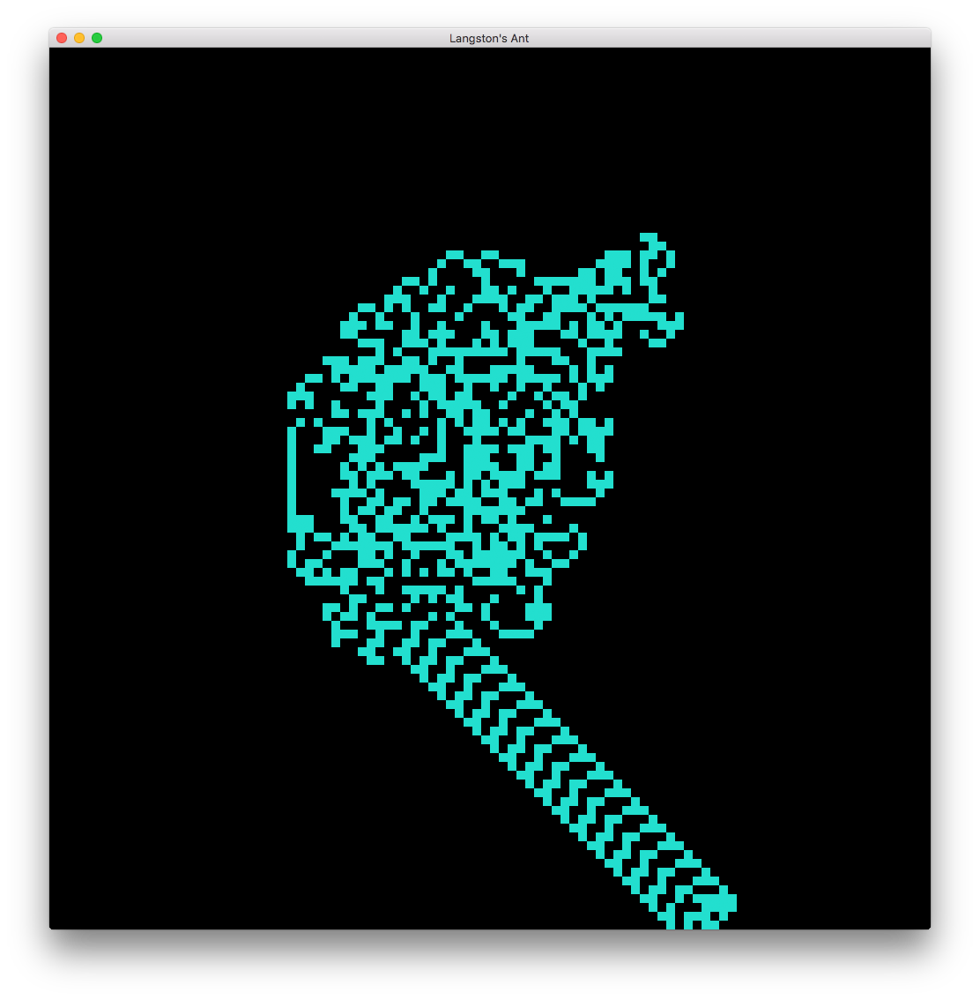
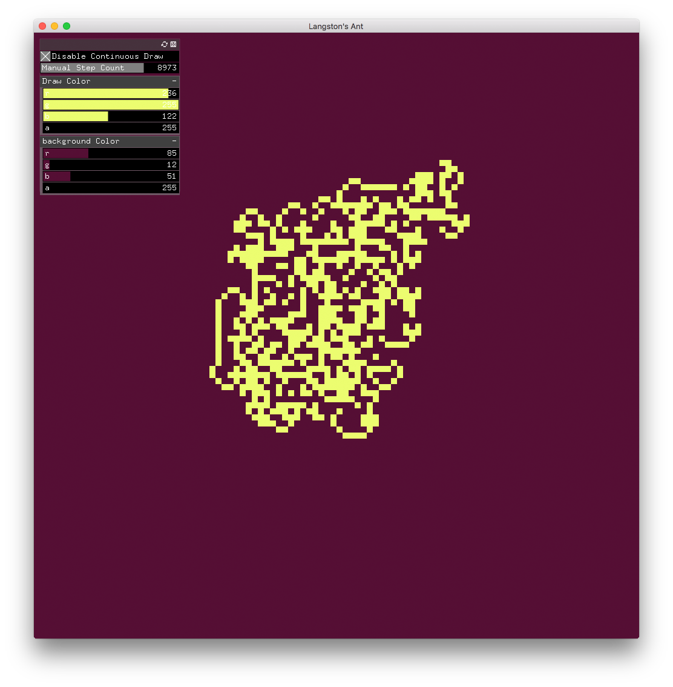
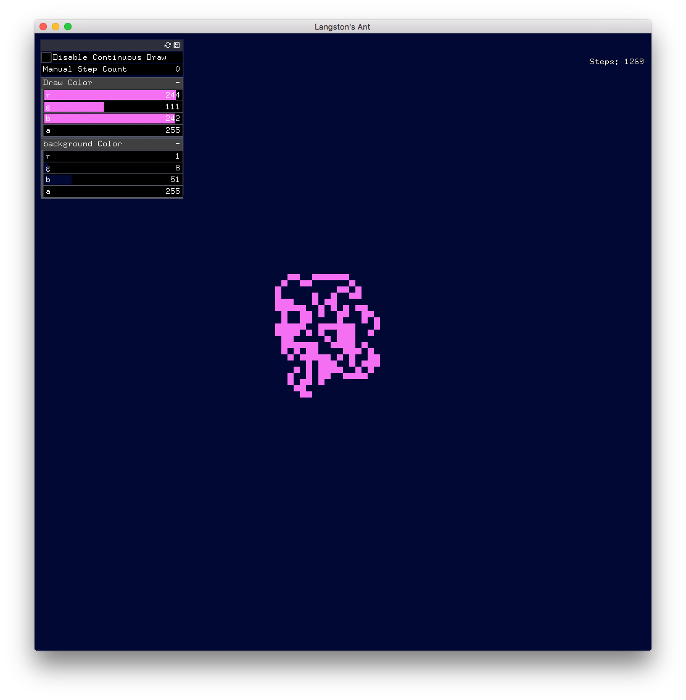

# Langston Had an Ant
An implementation of <a href="https://en.wikipedia.org/wiki/Langton%27s_ant">Langston's ant</a> built with openFrameworks. Supports custom colors and manual step control.

## Gallery
<br>
<br>
<br>

# Build
To use, simply place this project in the "myapps" directory of openFrameworks v0.9+
and compile with ```make``` or the xcode project.

# Authors
Created as an evening project for fun by <a href="https://github.com/theinnerparty">Leo Dastur</a> and <a href="https://github.com/samirgauche">Samir Ghosh</a>. <br>
Licensed for use uner the Creative Commons Attribution-ShareAlike 4.0 International (CC BY-SA 4.0) license.
